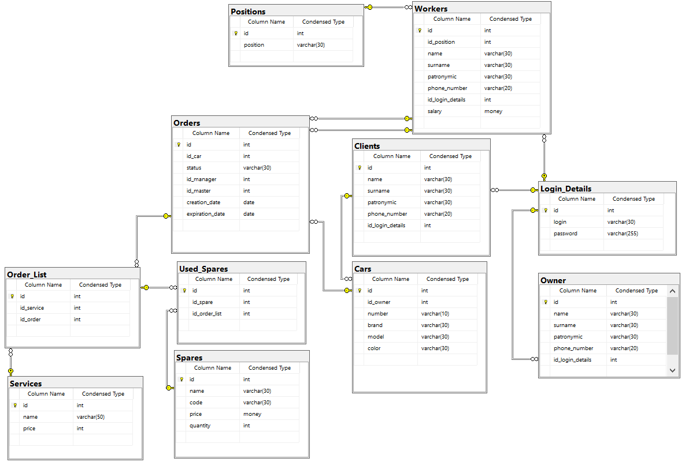
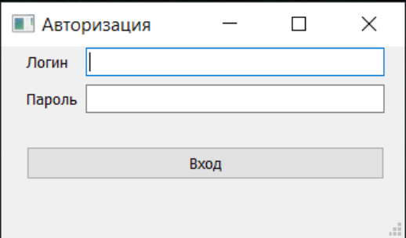
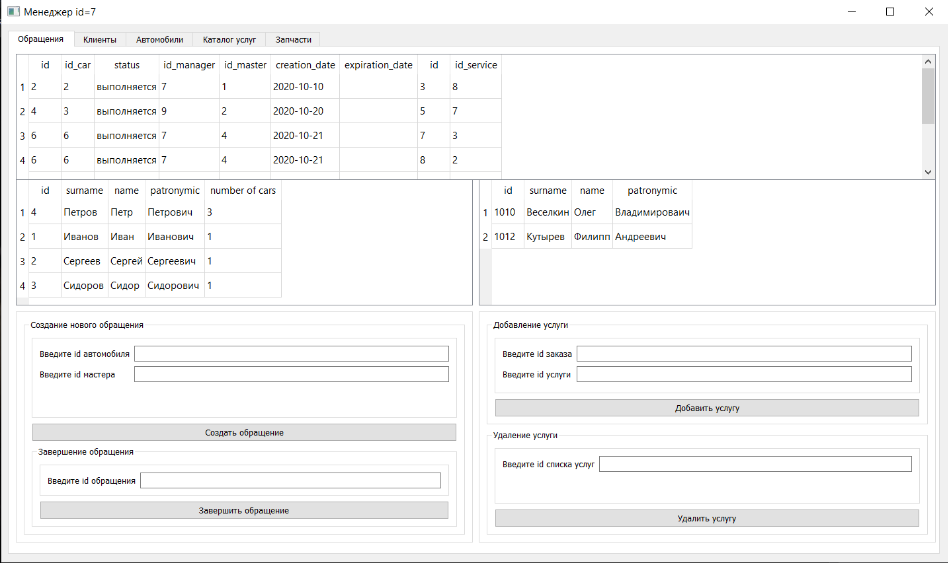

# Car Service

Многопользовательская автоматизированная система управления автосервисом. Проект состоит из базы данных MS SQL Server и десктопного клиентского приложения на Qt для удобной работы с базой: просмотра, добавления и изменения информации в зависимости от роли пользователя.

## Функциональность

Система поддерживает несколько ролей пользователей, каждая из которых имеет свой набор доступных действий:

- **Владелец** — управление учётными записями сотрудников и клиентов, просмотр общей информации по автосервису, управление каталогом услуг, просмотр оборота денежных средств.
- **Мастер** — просмотр и изменение данных о запчастях, ходе выполнения работ.
- **Менеджер** — оформление заказов, просмотр каталога услуг, изменение учётных записей клиентов.
- **Клиент** — просмотр каталога услуг, отслеживание своих заказов.

## Схема базы данных

## Интерфейс приложения

### Окно авторизации

### Окно менеджера

## Подробнее о проекте

Полное описание проекта, включая постановку задачи, ход разработки и выводы — в файле [report.pdf](report.pdf).
